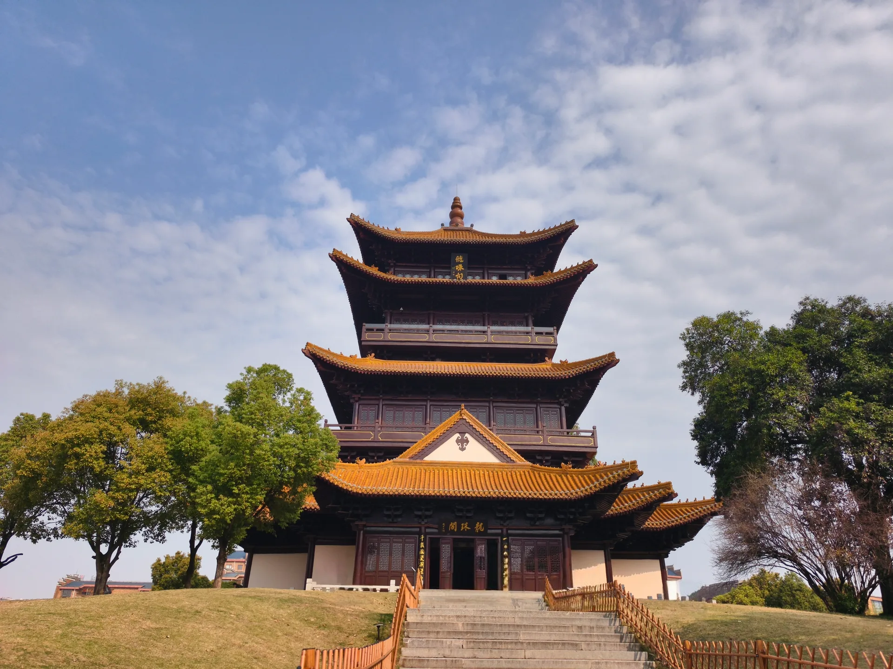
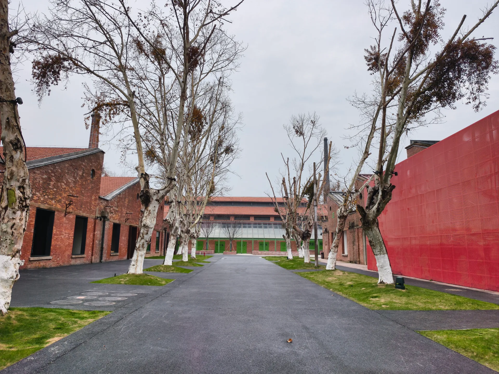
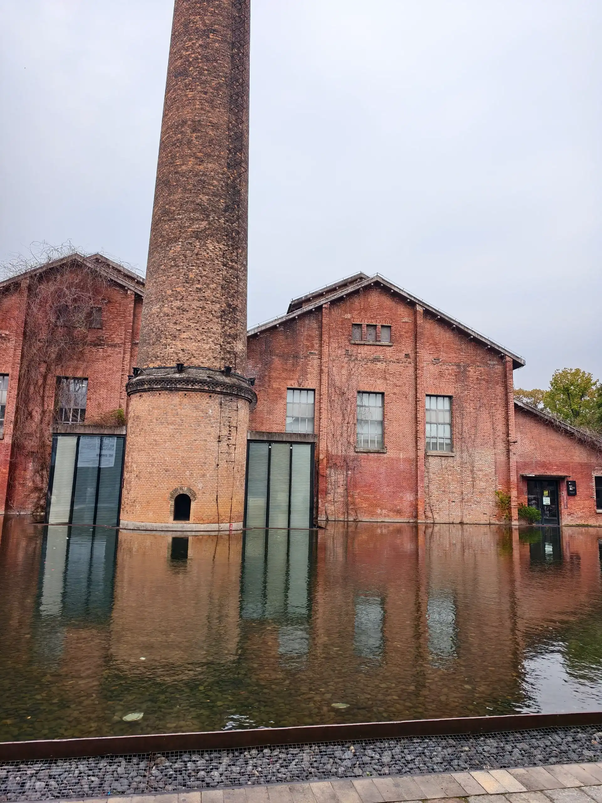

这次去景德镇，主要看了三处地方：陶阳里、中国陶瓷博物馆和陶溪川。逛完最大的感受是，景德镇最值得看的还是跟烧造史和陶瓷实物直接相关的东西；至于那些包装出来的"文创街区"，吸引力真的一般。

## 陶阳里：别只盯着御窑博物馆

陶阳里是收费景区，御窑博物馆包含在内。很多人冲着御窑博物馆的名头去，但说实话，馆本身体量不大，展品里残片偏多，单看这个馆的话期待别太高。

反倒是我随意走走碰到的内廷恭造、徐家窑这些点位更有意思。看一堆碎瓷片和站在真实窑炉遗址旁边的感觉完全不一样，"官窑""贡瓷"这些词终于不是书本上的概念了。

预约这块简单说一句：网上免费票不好抢，付费票反而容易买。不过到了现场发现很多时候也能直接约进去，不是节假日的话不用太焦虑。

## 中国陶瓷博物馆：这趟最值的一站

这馆我愿排第一。陶阳里是在旧址上感受历史现场，这里是把景德镇几百年的陶瓷史好好整理了一遍，值得认真逛半天。

最好提前预约，没约上的话网上有人代抢，算个备选方案。

馆内重点是 4 到 7 楼的常设展，低楼层反而一般。7 楼那个"无语佛"确实逗，但这座馆真正的价值不在一个网红展品——它把不同朝代、不同工艺、不同器型之间的脉络梳理得很完整，逛完会有种"景德镇为什么是瓷都"终于看明白了一点的感觉。

## 陶溪川：可逛，但不如雕塑瓷厂

陶溪川是我觉得可以不来的地方。它不算差，但整个逛下来就是一个包装得比较成熟的文创商业空间，逛完没什么回味。

如果来景德镇是想看陶瓷文化和手工业氛围，这里给的东西太浅了。同样的时间我更愿意去雕塑瓷厂，至少那边的气质更贴近景德镇本来的样子。

## 最后说两句

排个序的话：中国陶瓷博物馆最值得认真逛，陶阳里可以去但重点别只放在御窑博物馆，陶溪川可以跳过或者别抱期待，不如去雕塑瓷厂。

景德镇迷人的地方不在"文创"两个字，而在它作为瓷都攒下来的工艺传统、遗址和器物。抓住这一点，这趟就不会白来。
